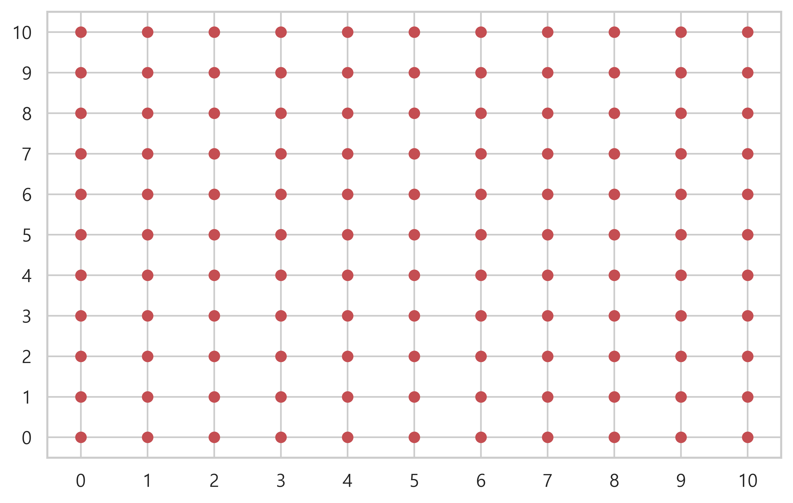
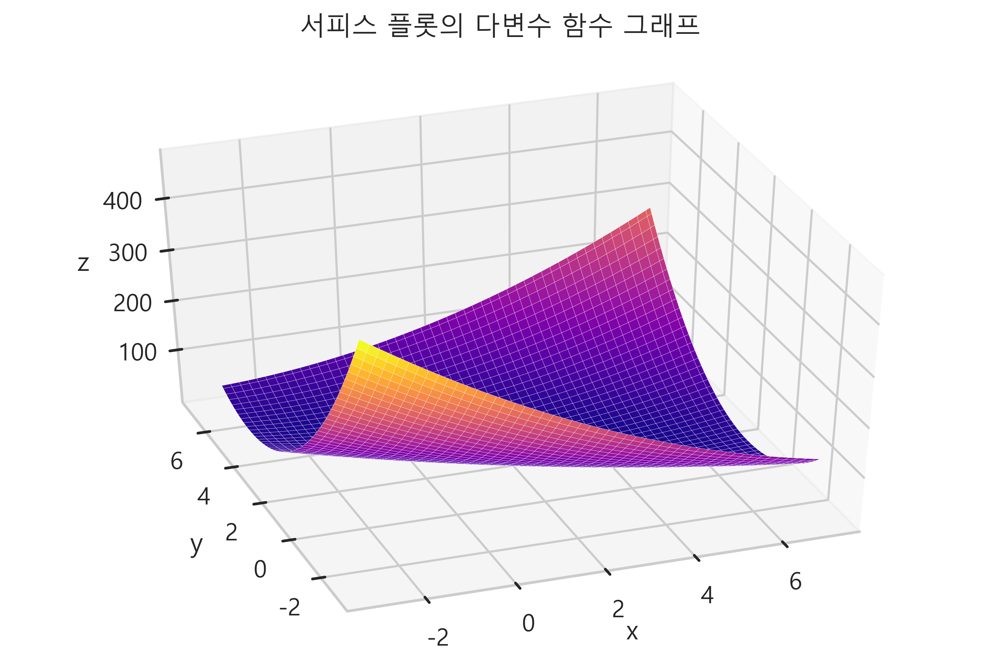

# meshgrid
- meshgrid 함수는 입력받은 배열의 모양을 변형시켜주며, 3차원 그래프를 그릴 때 주로 사용된다.
- np.meshgrid(x, y) : x 배열을 행벡터로 갖는 행렬, y 배열을 열벡터로 갖는 정방행렬을 두개의 변수로 반환한다.
- 하나의 열벡터로 두 개의 정방행렬을 만든다. 두 개의 정방행렬은 전치행렬 관계이다.
```
test_xx = np.array([1,2,3,4,5])
test_xx

=====<print>=====

array([1, 2, 3, 4, 5])


test_yy = np.array([6,7,8,9,10])
test_yy

=====<print>=====

array([ 6,  7,  8,  9, 10])

test_XX, test_YY = np.meshgrid(test_xx, test_yy)
test_XX

=====<print>=====

array([[1, 2, 3, 4, 5],
       [1, 2, 3, 4, 5],
       [1, 2, 3, 4, 5],
       [1, 2, 3, 4, 5],
       [1, 2, 3, 4, 5]])

test_YY

=====<print>=====

array([[ 6,  6,  6,  6,  6],
       [ 7,  7,  7,  7,  7],
       [ 8,  8,  8,  8,  8],
       [ 9,  9,  9,  9,  9],
       [10, 10, 10, 10, 10]])
```

- 0~10 까지의 정수들로 좌표 그려보기

```
x = np.linspace(0, 10, 11)
y = np.linspace(0, 10, 11)
XX, YY = np.meshgrid(x, y)

plt.scatter(XX, YY, c='r')
plt.xticks(range(11))
plt.yticks(range(11))

plt.show() ;
```


### 3차원 그래프에 meshgrid 함수를 적용
- 2차원 다변수 함수
```
def multi_variate(x, y) :
    return 2 * x**2 + 6 * x * y + 7 * y**2 - 26 * x -54 * y + 107
```
- 두 개의 입력 변수의 정의역 생성
```
xx = np.linspace(-3, 7, 100)
yy = np.linspace(-3, 7, 100)

xx

=====<print>=====

array([-3.        , -2.8989899 , -2.7979798 , -2.6969697 , -2.5959596 ,
       -2.49494949, -2.39393939, -2.29292929, -2.19191919, -2.09090909,
       -1.98989899, -1.88888889, -1.78787879, -1.68686869, -1.58585859,
       -1.48484848, -1.38383838, -1.28282828, -1.18181818, -1.08080808,
       -0.97979798, -0.87878788, -0.77777778, -0.67676768, -0.57575758,
       -0.47474747, -0.37373737, -0.27272727, -0.17171717, -0.07070707,
        0.03030303,  0.13131313,  0.23232323,  0.33333333,  0.43434343,
        0.53535354,  0.63636364,  0.73737374,  0.83838384,  0.93939394,
        1.04040404,  1.14141414,  1.24242424,  1.34343434,  1.44444444,
        1.54545455,  1.64646465,  1.74747475,  1.84848485,  1.94949495,
        2.05050505,  2.15151515,  2.25252525,  2.35353535,  2.45454545,
        2.55555556,  2.65656566,  2.75757576,  2.85858586,  2.95959596,
        3.06060606,  3.16161616,  3.26262626,  3.36363636,  3.46464646,
        3.56565657,  3.66666667,  3.76767677,  3.86868687,  3.96969697,
        4.07070707,  4.17171717,  4.27272727,  4.37373737,  4.47474747,
        4.57575758,  4.67676768,  4.77777778,  4.87878788,  4.97979798,
        5.08080808,  5.18181818,  5.28282828,  5.38383838,  5.48484848,
        5.58585859,  5.68686869,  5.78787879,  5.88888889,  5.98989899,
        6.09090909,  6.19191919,  6.29292929,  6.39393939,  6.49494949,
        6.5959596 ,  6.6969697 ,  6.7979798 ,  6.8989899 ,  7.        ])
```
- meshgrid(xx, yy) 로 정방행렬 생성
```
X, Y = np.meshgrid(xx, yy)

X

=====<print>=====

array([[-3.       , -2.8989899, -2.7979798, ...,  6.7979798,  6.8989899,
         7.       ],
       [-3.       , -2.8989899, -2.7979798, ...,  6.7979798,  6.8989899,
         7.       ],
       [-3.       , -2.8989899, -2.7979798, ...,  6.7979798,  6.8989899,
         7.       ],
       ...,
       [-3.       , -2.8989899, -2.7979798, ...,  6.7979798,  6.8989899,
         7.       ],
       [-3.       , -2.8989899, -2.7979798, ...,  6.7979798,  6.8989899,
         7.       ],
       [-3.       , -2.8989899, -2.7979798, ...,  6.7979798,  6.8989899,
         7.       ]])

Y

=====<print>=====

array([[-3.       , -3.       , -3.       , ..., -3.       , -3.       ,
        -3.       ],
       [-2.8989899, -2.8989899, -2.8989899, ..., -2.8989899, -2.8989899,
        -2.8989899],
       [-2.7979798, -2.7979798, -2.7979798, ..., -2.7979798, -2.7979798,
        -2.7979798],
       ...,
       [ 6.7979798,  6.7979798,  6.7979798, ...,  6.7979798,  6.7979798,
         6.7979798],
       [ 6.8989899,  6.8989899,  6.8989899, ...,  6.8989899,  6.8989899,
         6.8989899],
       [ 7.       ,  7.       ,  7.       , ...,  7.       ,  7.       ,
         7.       ]])
```
- 서피스 플롯을 사용하여 3차원 공간에 2차원 다변수 함수 표현
```
Z = multi_variate(X, Y)

fig = plt.figure()
ax = fig.gca(projection='3d')
ax.plot_surface(X, Y, Z, linewidth=0.1, cmap=cm.plasma)

ax.view_init(40, -110)

plt.xlabel('x')
plt.ylabel('y')
ax.set_zlabel('z')

plt.title('서피스 플롯의 다변수 함수 그래프', y=1.1)

plt.show() ;
```


