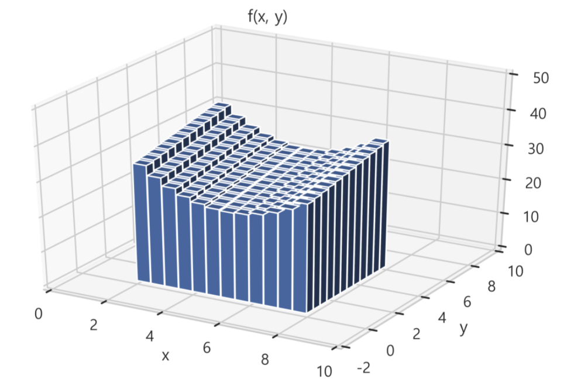

# ravel
- 넘파이의 배열의 형태를 바꿔주는 기능
- 행렬 데이터를 열벡터로 변형시켜 준다.
   - 행벡터들을 전치연산하여 하나의 열벡터로 이어 붙인다.
   - 1행을 전치하여 열벡터로 만든 것의 뒤에 2행을 열벡터로 만들어 이어붙이는 방식
- 3x3 행렬일 경우 9x1 열벡터가 된다.

## 기본사용

### 데이터 만들기
- 0부터 12까지 데이터로 갖는 배열 생성

```python
test_x = np.arange(12)
test_x

=====<print>=====

array([ 0,  1,  2,  3,  4,  5,  6,  7,  8,  9, 10, 11])
```

- 이 열벡터를 2로 나눈 후 2를 더해주면 2부터 0.5씩 증가하는 숫자배열을 만들 수 있다.

```python
test_xx = np.arange(12) / 2 + 2
test_xx

=====<print>=====

array([2. , 2.5, 3. , 3.5, 4. , 4.5, 5. , 5.5, 6. , 6.5, 7. , 7.5])
```

- np.meshgrid() 를 사용하여 행렬로 변형
- mesh_x 는 test_xx가 행으로 누적되어 만들어진 정방행렬
- mesh_y 는 test_xx가 열로 누적되어 만들어진 정방행렬

```python
mesh_x, mesh_y = np.meshgrid(test_xx, test_xx)

mesh_x

=====<print>=====

array([[2. , 2.5, 3. , 3.5, 4. , 4.5, 5. , 5.5, 6. , 6.5, 7. , 7.5],
       [2. , 2.5, 3. , 3.5, 4. , 4.5, 5. , 5.5, 6. , 6.5, 7. , 7.5],
       [2. , 2.5, 3. , 3.5, 4. , 4.5, 5. , 5.5, 6. , 6.5, 7. , 7.5],
       [2. , 2.5, 3. , 3.5, 4. , 4.5, 5. , 5.5, 6. , 6.5, 7. , 7.5],
       [2. , 2.5, 3. , 3.5, 4. , 4.5, 5. , 5.5, 6. , 6.5, 7. , 7.5],
       [2. , 2.5, 3. , 3.5, 4. , 4.5, 5. , 5.5, 6. , 6.5, 7. , 7.5],
       [2. , 2.5, 3. , 3.5, 4. , 4.5, 5. , 5.5, 6. , 6.5, 7. , 7.5],
       [2. , 2.5, 3. , 3.5, 4. , 4.5, 5. , 5.5, 6. , 6.5, 7. , 7.5],
       [2. , 2.5, 3. , 3.5, 4. , 4.5, 5. , 5.5, 6. , 6.5, 7. , 7.5],
       [2. , 2.5, 3. , 3.5, 4. , 4.5, 5. , 5.5, 6. , 6.5, 7. , 7.5],
       [2. , 2.5, 3. , 3.5, 4. , 4.5, 5. , 5.5, 6. , 6.5, 7. , 7.5],
       [2. , 2.5, 3. , 3.5, 4. , 4.5, 5. , 5.5, 6. , 6.5, 7. , 7.5]])

mesh_y

=====<print>=====

array([[2. , 2. , 2. , 2. , 2. , 2. , 2. , 2. , 2. , 2. , 2. , 2. ],
       [2.5, 2.5, 2.5, 2.5, 2.5, 2.5, 2.5, 2.5, 2.5, 2.5, 2.5, 2.5],
       [3. , 3. , 3. , 3. , 3. , 3. , 3. , 3. , 3. , 3. , 3. , 3. ],
       [3.5, 3.5, 3.5, 3.5, 3.5, 3.5, 3.5, 3.5, 3.5, 3.5, 3.5, 3.5],
       [4. , 4. , 4. , 4. , 4. , 4. , 4. , 4. , 4. , 4. , 4. , 4. ],
       [4.5, 4.5, 4.5, 4.5, 4.5, 4.5, 4.5, 4.5, 4.5, 4.5, 4.5, 4.5],
       [5. , 5. , 5. , 5. , 5. , 5. , 5. , 5. , 5. , 5. , 5. , 5. ],
       [5.5, 5.5, 5.5, 5.5, 5.5, 5.5, 5.5, 5.5, 5.5, 5.5, 5.5, 5.5],
       [6. , 6. , 6. , 6. , 6. , 6. , 6. , 6. , 6. , 6. , 6. , 6. ],
       [6.5, 6.5, 6.5, 6.5, 6.5, 6.5, 6.5, 6.5, 6.5, 6.5, 6.5, 6.5],
       [7. , 7. , 7. , 7. , 7. , 7. , 7. , 7. , 7. , 7. , 7. , 7. ],
       [7.5, 7.5, 7.5, 7.5, 7.5, 7.5, 7.5, 7.5, 7.5, 7.5, 7.5, 7.5]])
```

### ravel() 함수 적용
- mesh_x 에 함수 적용

```python
mesh_x.ravel()

=====<print>=====

array([2. , 2.5, 3. , 3.5, 4. , 4.5, 5. , 5.5, 6. , 6.5, 7. , 7.5, 2. ,
       2.5, 3. , 3.5, 4. , 4.5, 5. , 5.5, 6. , 6.5, 7. , 7.5, 2. , 2.5,
       3. , 3.5, 4. , 4.5, 5. , 5.5, 6. , 6.5, 7. , 7.5, 2. , 2.5, 3. ,
       3.5, 4. , 4.5, 5. , 5.5, 6. , 6.5, 7. , 7.5, 2. , 2.5, 3. , 3.5,
       4. , 4.5, 5. , 5.5, 6. , 6.5, 7. , 7.5, 2. , 2.5, 3. , 3.5, 4. ,
       4.5, 5. , 5.5, 6. , 6.5, 7. , 7.5, 2. , 2.5, 3. , 3.5, 4. , 4.5,
       5. , 5.5, 6. , 6.5, 7. , 7.5, 2. , 2.5, 3. , 3.5, 4. , 4.5, 5. ,
       5.5, 6. , 6.5, 7. , 7.5, 2. , 2.5, 3. , 3.5, 4. , 4.5, 5. , 5.5,
       6. , 6.5, 7. , 7.5, 2. , 2.5, 3. , 3.5, 4. , 4.5, 5. , 5.5, 6. ,
       6.5, 7. , 7.5, 2. , 2.5, 3. , 3.5, 4. , 4.5, 5. , 5.5, 6. , 6.5,
       7. , 7.5, 2. , 2.5, 3. , 3.5, 4. , 4.5, 5. , 5.5, 6. , 6.5, 7. ,
       7.5])
```

- ravel() 함수를 적용한 후 모양을 확인하면 144x1 인 열벡터이다.
```python
mesh_x.ravel().shape

=====<print>=====

(144,)
```

## 3d 그래프를 그릴 때 입력 인수로 사용할 수 있다.
- 다변수함수의 이중적분은 x, y 변수가 갖는 하한, 상한 값의 범위의 도형에 해당하는 부피
- 여기에서 범위는 np.arange()로 만든 배열의 처음과 끝

```python
fig = plt.figure()
### 3d plot 설정
ax = fig.add_subplot(111, projection='3d')

_x = np.arange(12) / 2 + 2
_y = np.arange(12) / 2

X, Y = np.meshgrid(_x, _y)
### ravel() 함수를 사용하여 열벡터로 변형
x, y = X.ravel(), Y.ravel()

z = x * x - 10 * x + y + 50
z0 = np.zeros_like(z)

### 변형된 데이터를 사용하여 3d 그래프 그리기
ax.bar3d(x, y, z0, 0.48, 0.48, z)

ax.set_xlim(0, 10)
ax.set_ylim(-2, 10)
ax.set_zlim(0, 50)
ax.set_xlabel('x')
ax.set_ylabel('y')

plt.title('f(x, y)')
plt.show() ; 
```

